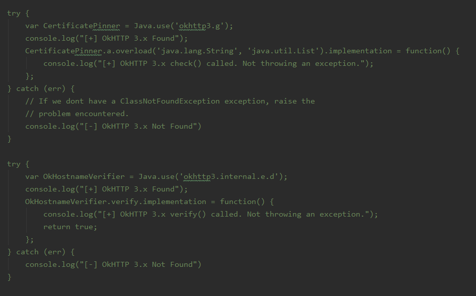
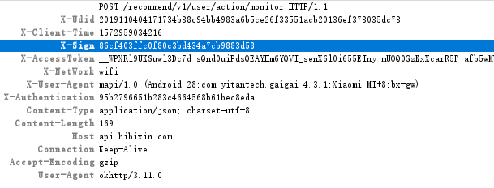
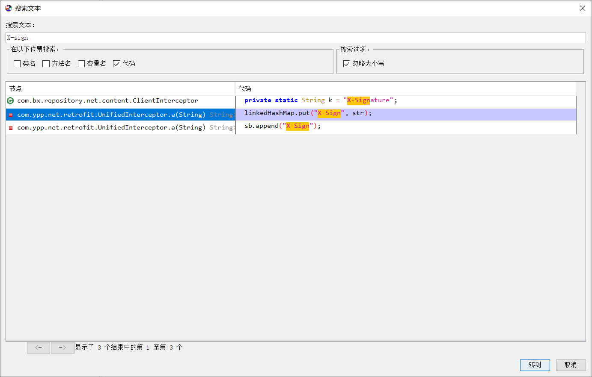
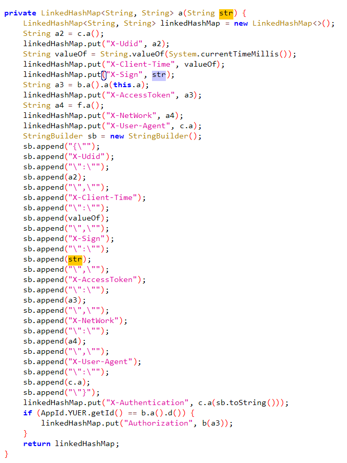
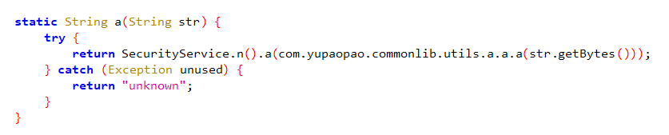
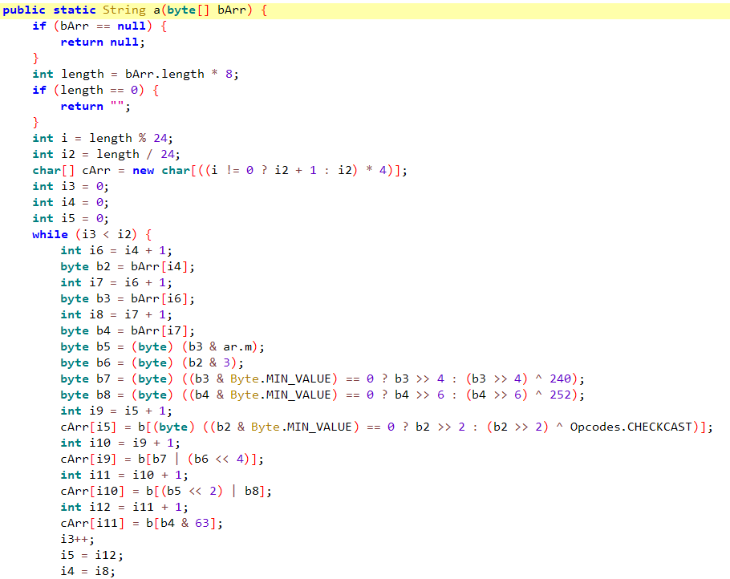
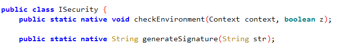
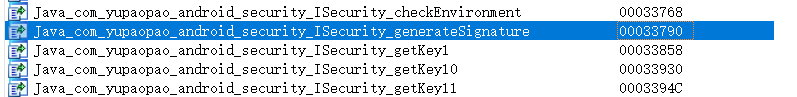
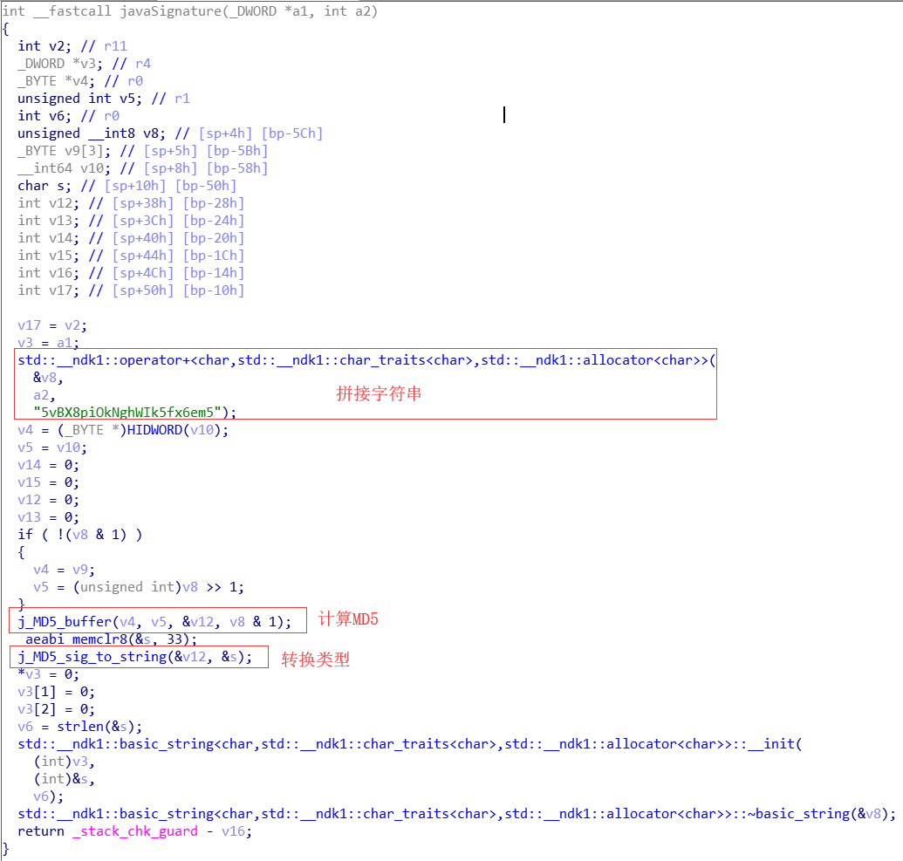

不要问我这个App是做什么的，我也不知道。

### 抓包分析

熟练地打开Charles，拿起手机输入代理，安装上HTTPS证书。打开App，嗯？certificate error，啥也没抓着。

熟练地打开Xposed，安装上Justtrustme。熟练地打开Magisk安装Move Certificates。重启。打开App，摔，还是老样子。

熟练地打开Jadx，拖入Apk，看到了Okhttp，点进去发现Okhttp也被混淆了，嗯，找到原因了。修改下Hook代码里边Okhttp的类名，再Hook。

可以抓到包了。观察headers，直觉告诉我们，X-Sign、X-Authentication是加密参数。X-Udid是设备ID，X-AccessToken记录了用户登录状态。

### Java层分析

再次打开Jadx，直接搜索X-Sign，相关的条数很少，先点进第二条。

可以发现headers就是在这里生成的，X-Sign，X-Authentication都能找到。其实可以总结出linkedHashMap经常被用来拼装headers和请求参数。

X-Sign的值是直接作为方法的参数传入的，而X-Authentication是方法c.a的返回值，该方法参数为headers字符串，可以想到这里是对headers整体生成一个校验参数。

追溯一下X-Sign和c.a方法源头，最后都找到了下图中的方法。

这里边首先取了待加密字符串的Bytes，随后调用com.yupaopao.commonlib.utils.a.a.a方法。点进去看一下这个方法。

嗯。花里胡哨的，这不就是base64吗？再看一下SecurityService.n().a方法，最后追溯到了ISecurity类中的generateSignature方法。

嗯。放在native层了

### Native层分析

简单分析下，这个函数把传入的参数转换类型之后传给javaSignature函数，然后再转回jstring。那其实关键就在于这个javaSignature

呃，什么嘛，就是MD5加点盐。

### 彩蛋

这次在抓包的时候，发现了老朋友某美SDK。很多小伙伴在登录或者注册App的时候会遇到无法登录的情况。其实就是和这个风控SDK有关啦，大概是机子里边Xposed什么的，或者频繁更换登录设备被检测到了，所以列入了黑名单。

如何解开其实也很简单，headers中的X-Udid其实就是某美SDK生成的deviceId，置为空字符串就行了。这应该是App特意留下的，防止某美SDK抽风的时候，所有用户都登录不了。

全文完~