### 抓包分析

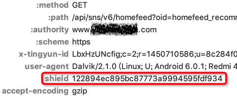  

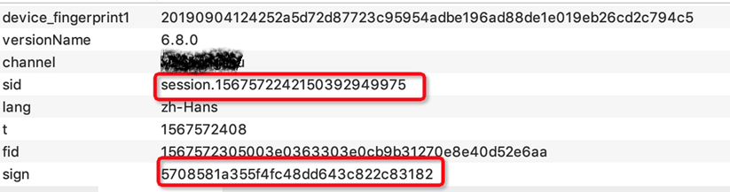  

Android 7.0起，应用不再信任用户添加的证书。此处为了方便用了手头Android 6.0系统的手机抓包，直接抓到了，可见在SSL Pinning上没有做什么手脚。

观察headers，直觉告诉我们shield是加密参数。再观察请求参数，发现有一个sign，嗯，很明显了。

另外device\_fingerprint1，由字面意思能看出是设备指纹的意思。APP必须要登录才能访问内容，sid就是登录服务器后，服务器分配的ID，表明用户身份。

### Java层分析

使用Jadx-gui打开apk，全局搜索sign。

  

搜索到的条数不多，随手点进j这个变量。

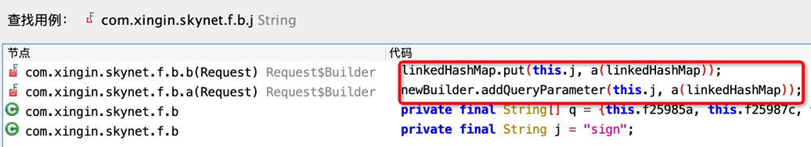  

可以看到这里边有linkedHashMap，put方法key是“sign”，value很像是对linkedHashMap的加密。下边的调用也类似。

追溯a方法，直觉能告诉我们，这就是加密请求参数的方法。接下来开始逐行分析。

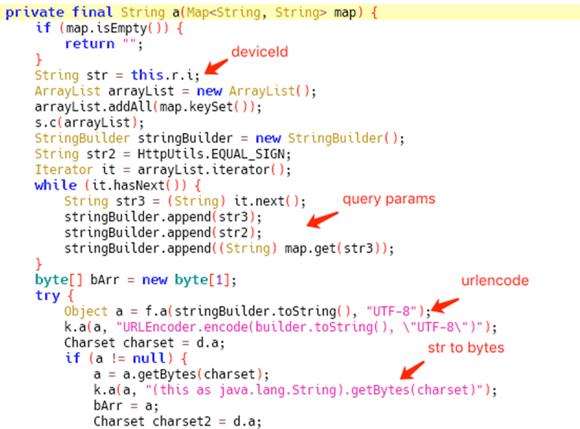  

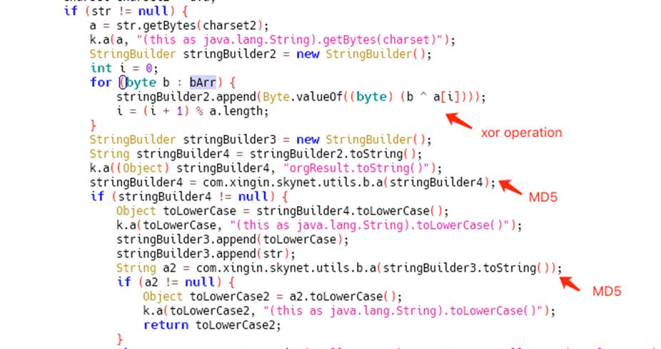  

可以发现，a方法其实就是把请求参数转化为byte数组，并做异或操作，最后MD5。

到此sign参数算是搞定了，接下来我们再看看shield参数。不花里胡哨，继续全局搜索shield。

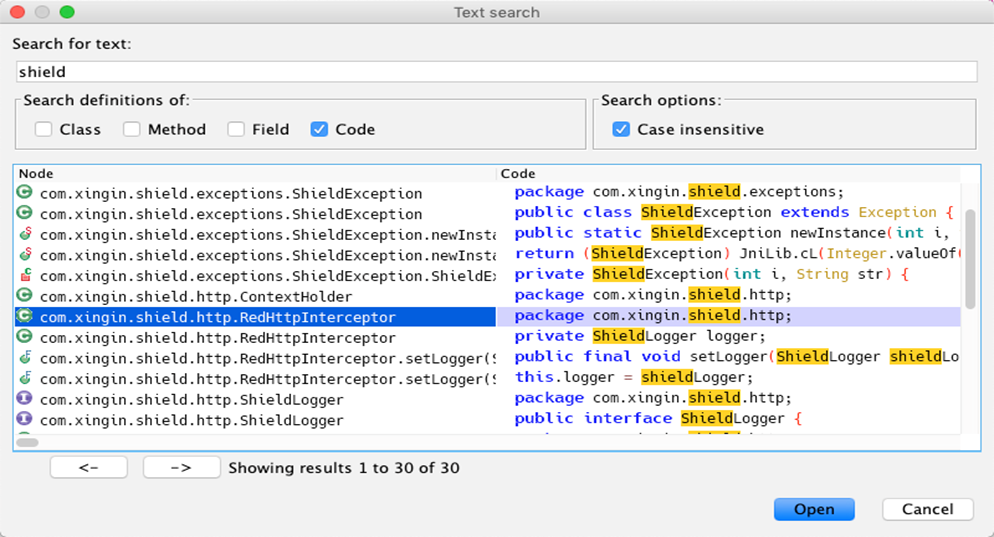  

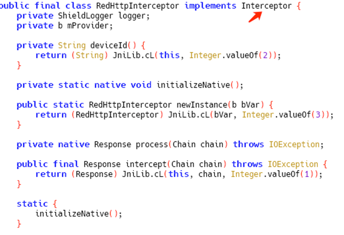  

搜索出的结果也不多，主要可疑的代码在RedHttpInterceptor这个类里边。在分析这个类之前，先介绍一下Okhttp。

Okhttp是一个高效的HTTP客户端，广泛在各种APP中使用。

Interceptor是 OkHttp 提供的对 HTTP 请求和响应进行拦截处理的强大机制，它可以实现网络监听、请求以及响应重写、请求失败重试等功能。在OkHttp 中可以设置任意数量的Interceptor来对网络请求及其响应做中间处理，比如设置缓存，HTTPS证书认证，统一对请求加密/防篡改，打印log，过滤请求等等。

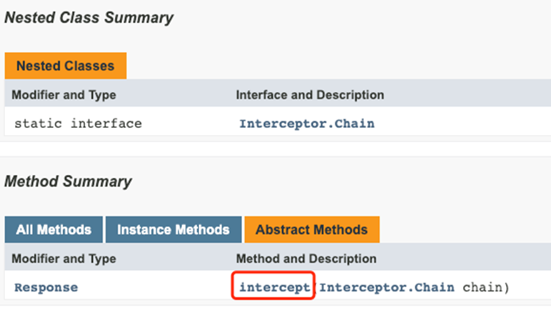  

查阅Interceptor这个类的文档，里边最主要的方法就是intercept。那么可猜测shield是在这个RedHttpInterceptor中的intercept方法添加进headers的。

但是Java层面的反编译并不能给我们带来这个方法的足够信息，代码被抽取到了so中，相信很多人走到这就陷入了僵局。

别无他法，这里能拿到的就是intercept方法的一个参数chain，再分析一下Chain。

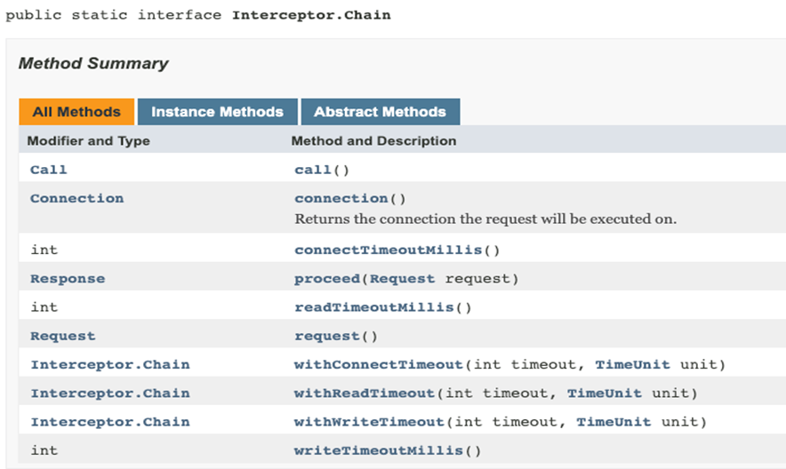  

正常来说想在intercept中修改request的headers会怎么做？

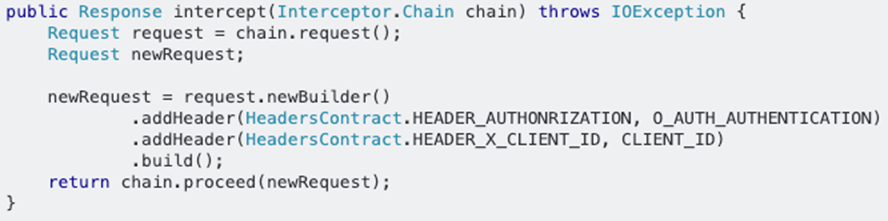  

取出chain对应的request，创建一个新的request，调用addHeader或header方法加入加密参数。可以想到，so中必定是通过JNI调用了addHeader或header方法加入了shield。

所以Hook okhttp3.Request$builder的addHeader或者header方法，当addHeader或者header第一个参数是shield的时候，取出第二个参数的值即为shield的值。

目前为止，我们通过代码复写和Hook可以拿到sign和shield两个参数了。

然而shield是通过Hook被动拿到的，也就是说在intercept方法执行的时候，才能拿到，无法主动获取。

所以想到的思路是Hook intercept方法，拿到执行该方法的object，就可以主动调用intercept方法了。

然而还有个问题，通过Hook拿到的shield对应的请求是客户端真实发出的，而不是我们想构造的请求。

由之前修改请求的headers代码启发，我们其实在interceptor中也能修改请求的URL，然后再调用intercept，那么拿到的shield就是URL对应的shield了。

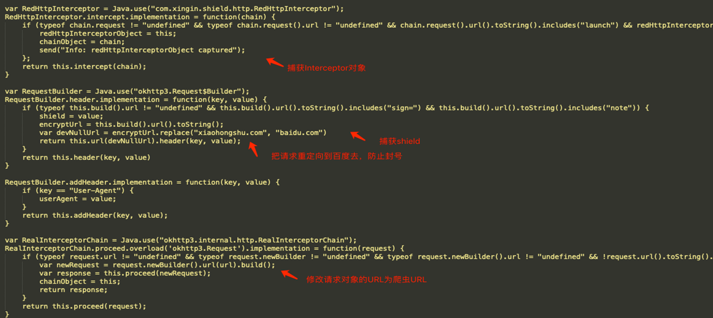  

这里边有个骚操作就是，在执行intercept方法的时候，我们的请求会到服务器，为了规避风险，可以在获取完shield之后更改下URL的host，把请求送去百度。

### Native层

在Java层获取shield还是有些费劲，在Native层获取会不会容易些？打开libs目录，里边libshield.so非常扎眼，直接拖到IDA中打开。

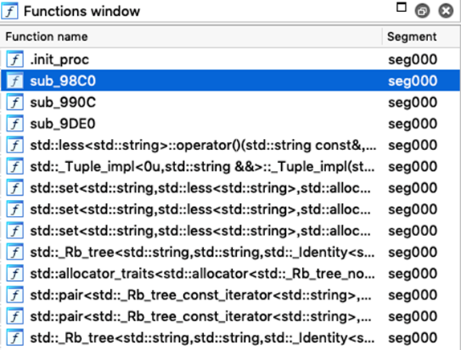  

发现内部函数只有3个，代码量也很少。很明显，这个so做了处理。

但和dex加壳一样，so在加载到内存执行的时候，肯定是解密的状态。于是用Frida写个dump小脚本，打开APP，找到libshield的内存地址，dump。

  

这次拿到的so文件比之前的515KB明显大了许多。但从内存中dump出的so是缺少section header table的，使用现成的Sofixer简单的修复下。

将修复好的so文件拖入IDA，习惯先按下shift+F12查看so中的所有字符串，可以发现这次字符串都正常显示了。

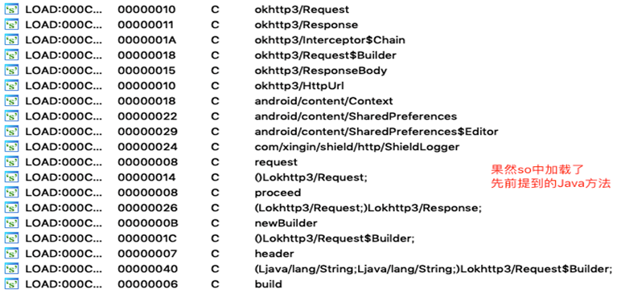  

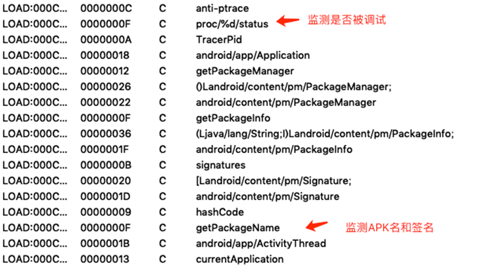  

寻找s开头的字符串，发现了shield，点击跳转，最终找到调用的内部函数。

  

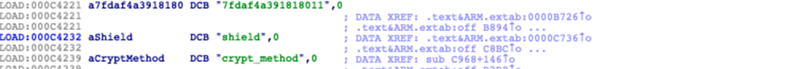  

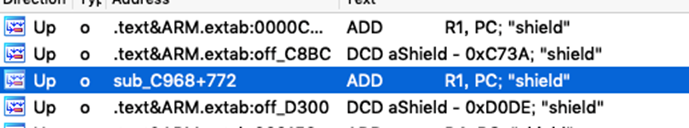  

定位到sub\_c968，按下F5，转换下JNIEnv。这里边代码比较清晰，找到shield附近。

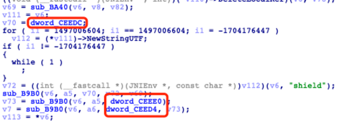  

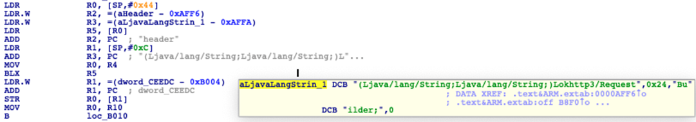  

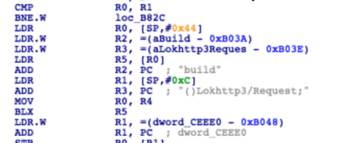  

这里调用了Java层的requestBuilder的header方法和build方法，把shield添加进了header中，印证了我们之前的分析。

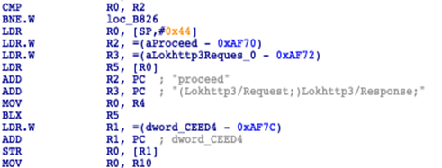  

调用proceed方法，执行了添加header之后的request。

接下来分析下shield也就是v69变量是如何生成的。sub\_BA40有两个参数v8和v82，通过hook发现v8是deviceId，v82是请求参数

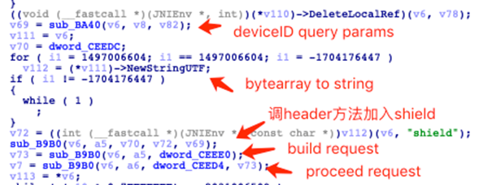  

至此，可以分析出是sub\_BA40接收deviceId和请求参数，然后一顿运算生成出了shield，那么Hook该函数能非常高效地获取到shield了。

来看一下sub\_BA40吧。

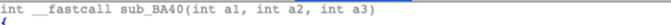  

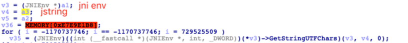  

a3是JNI方法 GetStringUTFChars的参数，那么a3的类型必然为jstring

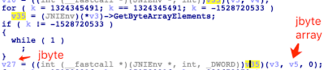  

a2是JNI方法 GetByteArrayElements的参数，那么a2的类型就是jbyte array。

到这边知道了参数类型，用Frida Hook sub\_BA40就可以为我们稳定地获取到shield了。

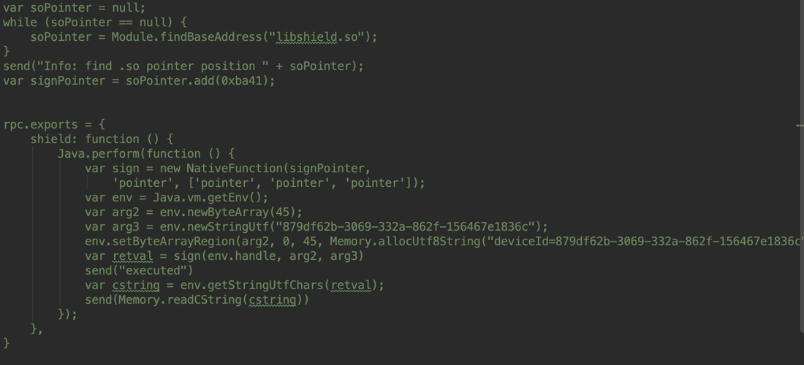  

全文完。

什么，你说都走到这一步了，还不继续？

从内存中dump出的so有许多函数都无法正常解析，再加上ollvm混淆，阅读起来比较费劲。

行吧，sub\_BA40 最终返回了v20，v20是v28调用newStringUTF而来的，v28是sub\_124BC根据v35计算而来的。

经过动态调试发现，sub\_12628和sub\_124BC是一对的，分别用来把string转为bytes，把bytes转为string。

那么v35是哪来的呢？

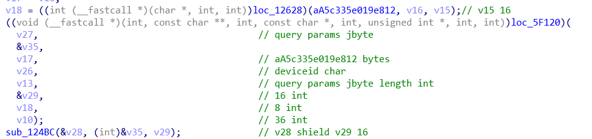  

嗯，还是根据请求参数和deviceId计算来的，线索就是位于5F120的函数了。

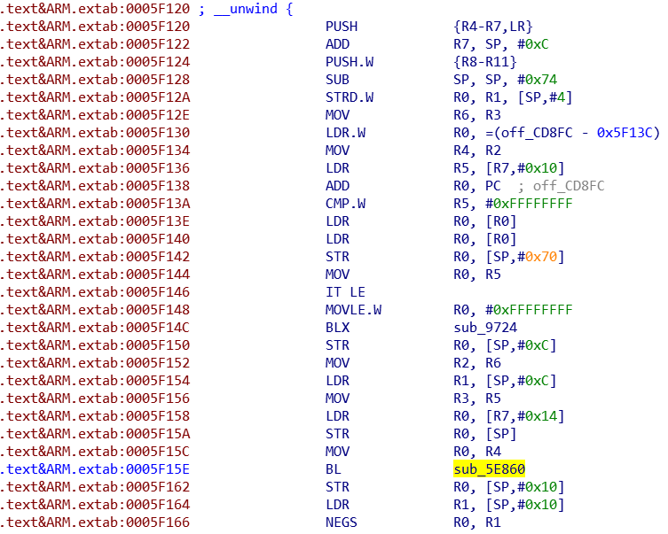  

这里边只能看到一个sub\_5E860，函数里主要调用了5E564，5E6B4。

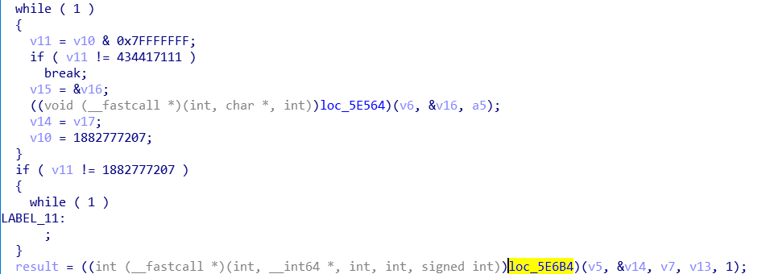  

看到这里，隐隐觉得5E6B4最后的1是对称加密里边的加解密模式参数。到这里有些无从下手了。

后来想到，会不会老版本的apk没有对so加密&混淆呢？还真的被我找到了一版...

大概逻辑和之前分析的so大致相同，虽然这个版本已经过期了，但还是具有参考价值。

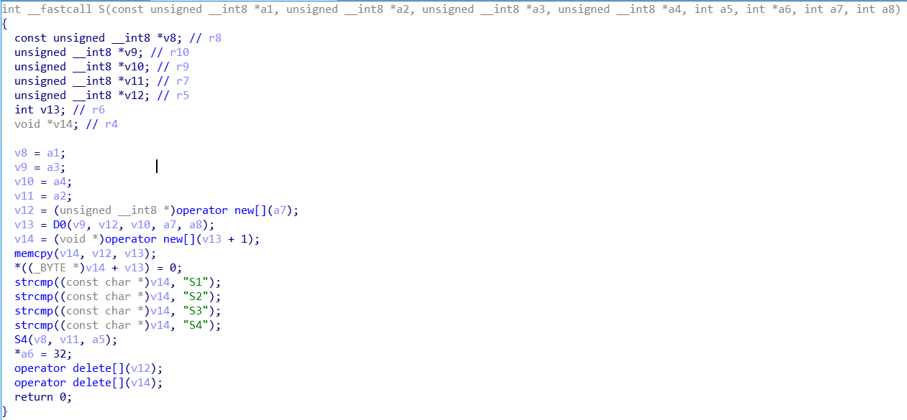  

重新定位到之前的5F120函数，在这里是S函数，里边D0函数对应的就是原so的5E860，S1-4函数对应的是5E918-5ED60。

分析S的返回参数是a2，由S2，S4函数生成。

S4函数的a1为请求参数，a2为返回值，a3请求参数的长度。

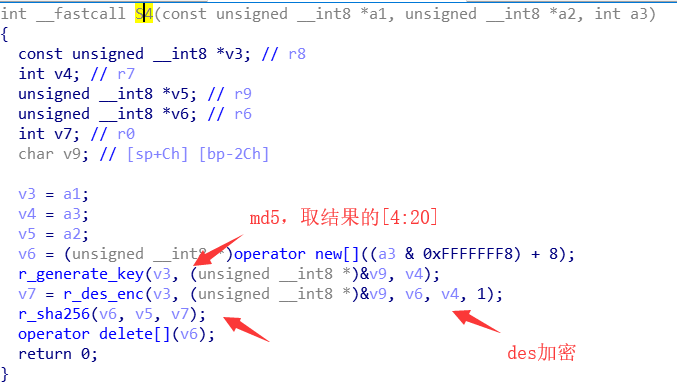  

嗯，清楚了。继续脱壳的so中回来找映射，都找着了。
```
5E724 r\_generate\_key
5E644 r\_des\_enc
5E564 md5
5E5d4 sha256
```
其实这个版本的加密逻辑还是没有变啊。先用xxx生成xxx加密密钥，xxx加密后做xxx或者xxx（由服务器返回的字符串解密决定）。

最后把加密的bytes转为string的时候指定了取前16个bytes，而老版本是32个bytes。这也就是为什么老版本shield长度为64，而新版本是32位吧。

(这里隐去具体算法)

全文完。

附一些bytes分析的代码块：

```
console.log("Reading from address: " + result);
var a = Memory.readByteArray(result, 256);
console.log(a);


var b = new Uint8Array(a);
var str = "";


if (b[i].toString(16).length == 1) {
    str += ("0" + b4[i].toString(16));
} else {
    str += (b[i].toString(16) + "");
}
console.log(str);
```