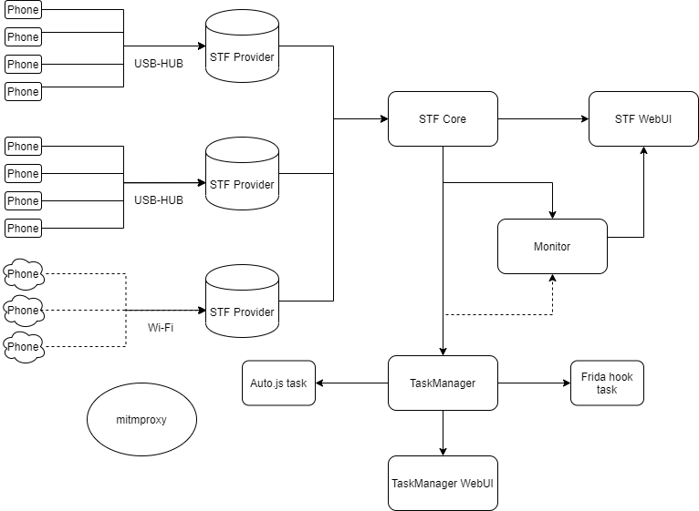

# 前言

近几年，各网站和App对核心内容的保护意识大大提高，反爬机制和风控的手段多种多样。移动互联网步入后半场，各厂倾向于在自家的APP中分发内容，PC/H5站点的内容正在萎缩，甚至消失不见。

对于爬虫（一个特殊的用户）来说，主战场变了，过去在浏览器端可能是解决一个JS加密，造一个代理IP池，加个验证码识别，字体、CSS反爬这种花里胡哨的就不提了。在App上，我们需要做什么？App逆向，你可能需要会脱壳，会反编译，会hook注入，会动态调试等等。

以为攻破加密算法，通讯协议就万事大吉吗？其实攻破协议是相对简单的，后边面对的还有风控，采集几百种设备的信息，记录无数次的用户行为判断你的设备特征是否正常，用户行为是否正常。从硬件底层信息采集，到大数据分析，可以说是“无微不至”了。

爬虫工程师的学习曲线陡峭了很多，可能前一天愉快的学会了Xpath，后一天就要面对逆向、图像识别。最近面试了很多爬虫工程师，同时自己也在找工作的过程中。

在我看来，一个好的爬虫系统应是充分解耦的，也就是说爬取的逻辑要和所需要的资源分离开，从爬虫的基础模块开始梳理起。

# 入门篇

我们想象一下单个HTTP请求都包含哪些要素？首先得有个URL，其次是headers请求头包含Cookie，还有就是proxy代理。

这就已经拆解出两个基础模块，一个是代理模块，一个是Cookie模块。

## 代理模块
代理模块分为两种，一种是用来避免IP封禁的代理IP池，另一种是中间人代理服务，用于JS注入，Cookie\token获取和response拦截。

### 常规代理IP
*类型*
* http代理
* https隧道代理
* https中间人代理

很多人对于https代理的概念是比较模糊的，这里具体讲一下https隧道代理和https中间人代理的差别。

https隧道代理，在客户端和服务端之间建立通道，转发TCP数据流，无需也无法知晓其中的具体内容。而https中间人代理，基于中间人攻击的思想，对客户端假装为目标服务端，对服务端假装为客户端。有个常见的应用场景是抓包，在抓https的包时，我们需要在客户端上信任证书，使得中间人代理成为一个受信的证书颁发机构，从而可以动态生成服务端证书，伪装为目标服务端。

*来源*

| 类型 | 价格 | 特性 |
|  ----  | ----  | ----  |
| 端口扫描（常说的免费代理IP） | 免费 | 代理IP量少有限，可用率低 |
| 蜂窝网络  | 低 | 海量代理IP，开发成本高 |
| 第三方代理服务，URL提取型 | 高 | 海量代理IP，一般可用率90%左右，开发成本中  |
| 第三方代理服务，动态隧道 | 高 | 海量代理IP，一般可用率90%左右，开发成本低，灵活性低  |
| 固定\弹性IP\拨号VPS | 高 | 代理IP量有限，稳定性高 |

对于成本有要求，同时对技术有自信，可以选择使用蜂窝网络建代理IP池。其余情况还是推荐使用第三方代理服务。这里有一篇评测第三方代理服务的文章，可以作为参考[十万火急的数据采集项目，爬虫代理测试对比](https://www.v2ex.com/t/537186)。

*轮换策略*

如何判定代理IP被封，是代理IP池的一个难点，一个HTTP请求失败有各种原因，Cookie失效，User-Agent被封（在UA池完善的情况下很少出现），加密参数改版（小概率事件）等等。如果没有判定出真正的原因，直接切换代理IP会造成浪费。实际中，在更换多次代理IP请求仍然无效时，应及时停止爬虫程序，并按P0等级报警。

*调度策略*

代理IP的调度策略需要结合网站的特点做选取和调整，一般实用的有这三种
1. 贪婪模式，在一个代理IP可以使用时，尽可能多的使用
2. 随机或轮询模式
3. 贪婪模式和随机模式结合，挑出若干个代理IP，并随机或轮询使用

### 中间人代理服务
中间人代理的原理，mitmproxy的文档讲的不错[How mitmproxy works](https://docs.mitmproxy.org/stable/concepts-howmitmproxyworks/)，可以参考下。它的使用场景很多，主要以下有几个

* HTTPS抓包，顺便说一下App的抓包，有几个注意的点
    1. 以API 24也就是Android 7.0为target API的App默认不信任用户安装的证书，[Changes to Trusted Certificate Authorities in Android Nougat](https://android-developers.googleblog.com/2016/07/changes-to-trusted-certificate.html)。最简单的方法是使用Magisk中的Move Certificates模块
    2. SSL Pinning，一句话就是检查特定的证书或者公共密钥是否在证书链中，防范中间人攻击。一般Hook App中HTTP客户端的相关方法即可绕过。
* selenium驱动浏览器被检测到时，可以拦截并修改JS代码，绕过检测。另外也在过去的文章中提到过，可以向JS注入websocket连接，实现浏览器和服务端的通信，执行加密函数或者操纵浏览器
* 模拟点击手机需要截获请求的response/Cookie/token

## Cookie模块
*来源*

| 类型 | 获取方式 | 成本 |
|  ----  | ----  | ---- |
| 服务端返回 | 正常请求 | 低 |
| 服务端返回 | 验证码识别 | 中 |
| 服务端返回 | 模拟登录 | 高 |
| 客户端运算 | 浏览器渲染，App抓包/Hook | 不确定 |

其实可以看出，Cookie模块这是一个偏上层的模块，在复杂的场景下，需要其他基础模块的支持，包括代理IP模块，验证码识别，浏览器集群和手机群控。

*轮换&调度策略*

在生产环境中，判定Cookie失效和判定代理IP失效一样难以判断，我的策略是对于获取成本为低或者中的Cookie，更换Cookie的优先级高于更换代理IP，反之优先更换代理IP。调度策略和代理IP的调度策略类似，不赘述，我通常使用随机模式。

# 进阶篇

接上回，Cookie模块中很重要的一个组成部分就是验证码识别。并且在实际情况中，一个HTTP请求除了Cookie和代理IP，往往还需要在URL或者headers里加上加密参数。这些因素的加入，极大的提高了爬取的难度。加密参数生成的算法一定是在客户端（App/浏览器）侧能够找到的。同时爬虫作为一种特殊的客户端，借助App和浏览器往往也有奇效。

## 验证码识别

2020年，一个合格的爬虫工程师，在面对验证码识别相关的面试题，还提出使用打码平台，那就有点说不过去了。常见的验证码，大概是这些，而且很多网站的验证码都是同一个服务商提供的，技术同质化严重。

| 类型 | 识别方式 | 成本 |
|  ----  | ----  | ---- |
| 数字/字母/汉字验证码 | 简单去噪处理+深度学习，推荐一个开源项目 [captcha_trainer](https://github.com/kerlomz/captcha_trainer) | 低 |
| 滑动验证码 | JS逆向+缺口识别+轨迹模拟，烂大街了 | 中 |
| 物体识别验证码 | 深度学习 | 高 |
| 汉字点选验证码 | 深度学习（汉字定位+汉字识别），可参考先前的文章 | 高 |
| 拼图验证码 | 未研究 | 高 |

## 手机群控

手机群控是最能体现一家公司的爬虫功底的，不过这部分的技术市面上很少有人分享，本文将重点讲解。

*架构*

主流的手机群控系统有STF和atxserver2，功能大同小异，相对来说STF的社区更大一些，总体架构图如下。

*名词解释*

| 名词 | 解释 | 
|  ----  | ----  |
| Phone | Android设备或模拟器 |
| USB-HUB/Wifi | 连接手机的方式，USB或无线连接 | 
| STF Provider | Ubuntu电脑，部署STF的Provider模块，负责手机设备的连接 |
| STF Core | 部署STF的核心模块，一般在生产环境服务器，负责与Provider连接，提供管理手机的API给TaskManager |
| STF WebUI | 部署STF WebUI，一般在生产环境服务器，提供远程操纵手机的网页界面 |
| TaskManager | 任务管理模块，负责从STF Core中获取设备，执行模拟点击或Hook任务 |
| Auto.js task | 基于Auto.js实现的模拟点击任务 |
| Frida hook task | 基于Frida实现的hook任务 |
| TaskManager WebUI | 任务管理模块，提供网页界面，用于查看任务情况 |
| Monitor | 监控手机和任务状态 |
| mitmproxy | 中间人代理，截获HTTP请求 |

*硬件*

搭建手机群控最基本要考虑的是硬件，手机选用什么型号，使用什么Wifi路由器，充电器甚至说数据线都会影响到整体系统的稳定性。

1. 手机，建议统一型号。很多人热衷于nexus系列，没有BL锁，可以随意刷机。不过我个人倾向购买红米系列，如红米note4x（mido）其实是一个非常好的选择，注意要购买解完BL锁的。具体选择红米note4x的原因如下。
    1. 市面存量大，一个是价格低廉且便于购买，另一个是主流机型被风控识别的风险小
    2. 庞大的ROM数量
    3. 电池容量大，并且鼓包情况少
2. Wifi路由器，用于给手机提供网络，并且负责手机和群控节点的连接。Wifi路由器的稳定性尤为重要，推荐NETGEAR和华硕，每个WiFi路由器连接15台手机。
3. USB-HUB/充电器，如使用USB连接手机和群控节点，则需要一个USB-HUB，这里推荐西普莱A-400 usb2.0 10口 120w独立供电版本，这款USB-HUB也可以当充电器来使用。
4. 数据线，如使用USB连接手机和群控节点，最好是原装线，否则会有掉线的风险。
5. 智能插座和插线板，智能插座用于控制充电，防过充，插线板就没什么好说的了
6. 生产环境服务器

*手机环境*
1. ROM选择Lineagos 15.1，安装Magisk，Xposed Framework v90-beta3
2. 借助Magisk实现Root和开机启动，如启动frida，打开adb无线连接，可以放在`/data/adb/service.d/`
3. Xposed模块按需使用，常用的有SSL unpinning
4. Auto.js 4.1.1a版本，打开稳定模式和无障碍模式

*任务管理*
* 模拟点击任务
    1. 模拟点击的实现方式
        * AccessibilityService无障碍服务
        * sendevent/ioctl向驱动`/dev/input/event*`写入触摸事件
        * 使用tricky的方式，调用injectInputEvent
    2. 模拟点击的时机
        * 通过AccessibilityService的接口判断UI相关信息
        * lua脚本
    3. 反识别
        * Auto.js修改关键特征，如文件夹路径和包名
    4. 打点log
        * 模拟点击可控性差，弹窗等情况会干扰任务执行，推荐关键步骤打log并监控
* Hook任务
    1. Hook的实现方式
        * Java层hook的主要原理是劫持虚拟机，Native层是inline hook，比较成熟的有Xposed/frida，推荐使用frida
    2. Hook的切入点
        * 加解密方法
        * 获取内容的方法
    3. 反识别
        * 这块就很讲究了，检测项繁多，可以参考之前逆向风控SDK的文章，后续也会专门整理
* 任务管理，两类任务在生产环境中会出现各种意料以外的情况
    * 代码鲁棒性
    * 设备连接和状态监控，WIfi和USB不可靠，手机也不可靠，借助STF Api做好设备的连接和状态监控
    * 全面的打点日志，模拟点击任务的每一步都推荐打点，hook任务主要是监控frida的相关报错，frida本身偶尔也会出现bug，报Connection Error，这时候需要做好frida server的重启，必要时重启手机
    * 对于加解密方法的hook调用需要做好负载均衡，每个加解密参数的接口分配三台及以上设备
    
## 浏览器集群

浏览器集群的用处和手机群控大同小异，包括JS注入（篡改JS实现反反爬，调用JS加密函数获取加密参数）和网页渲染。

*架构*

*核心组件*

架构图中最重要的是hromium和CEF，Chromium浏览器引擎不用多说，CEF提供了一套产品级稳定的API来操作Chromium。其余的组件选型相对比较多样，都是工程上的实现

*Chromium二次开发*

修改字体、插件、webgl、canvas等接口，实现属性随机，规避浏览器指纹的检测

# 玄学篇

## 养号

主流的高日活内容平台，如某手、某音、某信、某微、某红书，获取核心内容必须要登录，涉及到账号。

这块很敏感也比较玄学，不展开说了。
