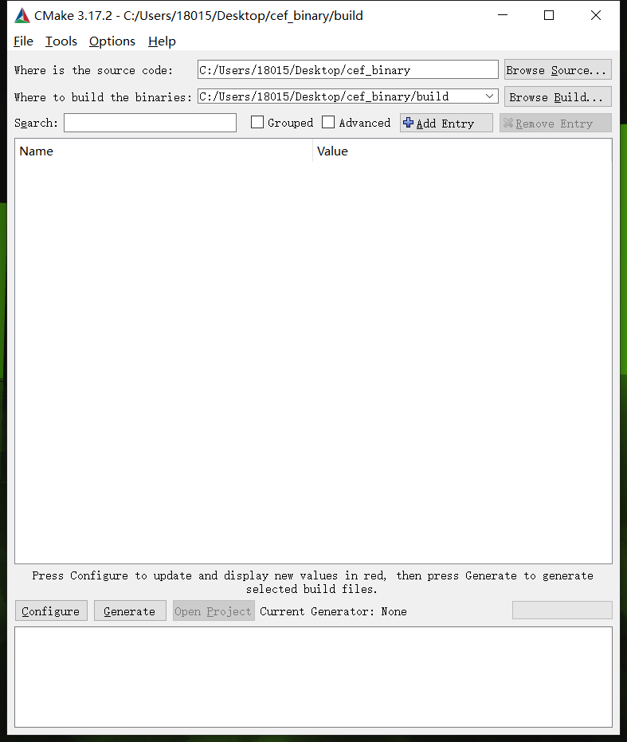
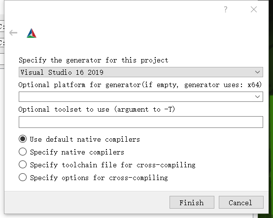
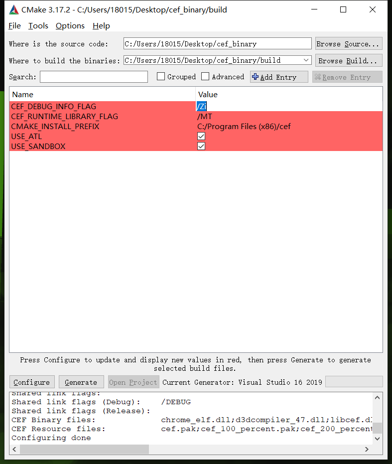
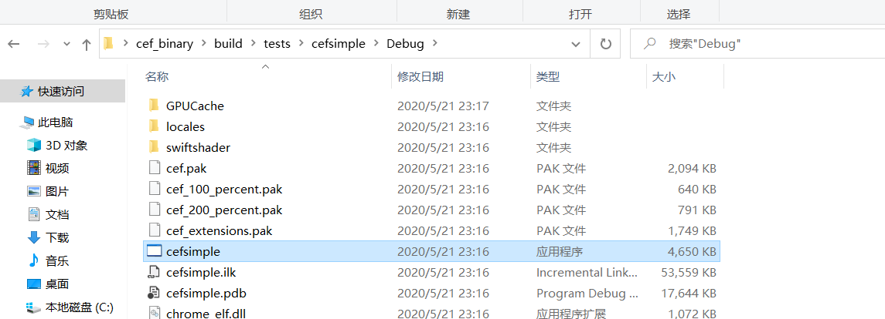

## 背景

在JS动态加载遍地都是的现在，通用爬虫系统离不开强大的浏览器集群。市面上有诸多关于selenium和puppeteer操纵浏览器进行爬取的教程。但是随着反爬技术的发展，selenium的特征很容易被检测，这里有一些相关的讨论：[Can a website detect when you are using selenium with chromedriver?
](https://stackoverflow.com/questions/33225947/can-a-website-detect-when-you-are-using-selenium-with-chromedriver)。当然清除selenium特征，或者篡改检测的代码也是一种应对策略。除了自动化测试流派，是否还有其他操纵浏览器的方式呢？本文提出基于CEF（Chromium Embedded Framework）和Chromium，定制一套专业的爬虫浏览器环境，并工程化为浏览器集群。

## Chromium

反爬技术中的浏览器指纹，即获取浏览器具有辨识度的独一无二的特征，计算出值来作为浏览器的标识，正在被广泛使用。

Chromium是一个开源浏览器项目，相比Chrome浏览器，其开源属性让我们有了修改和定制浏览器的机会，以规避基于浏览器指纹的反爬，增加专属于爬虫的功能。

### 浏览器指纹对抗

### 定制

## CEF

CEF是支持在其他应用中嵌入Chromium浏览器的框架，提供了丰富的接口以操纵浏览器。这里主要介绍下CEF的编译和二次开发。

### 编译
注：以下编译是在Windows x64环境下进行的。

推荐使用已编译好内核的[libcef](http://opensource.spotify.com/cefbuilds/index.html#windows64_builds)，选择Standard Distribution。另外，还需要下载一款跨平台的编译辅助工具[CMake](https://cmake.org/download/)，选择Windows win64-x64 Installer。最后当然还得下载个Visual Studio 2019，需要安装的组件有Windows 10 SDK、MSBuild、用于Windows的C++ CMake工具。

准备完这些之后，先打开cmake-gui，where is source code选择cef_binary所在的文件夹，where to build the binaries在cef_binary里边新建一个build目录，总体如下图所示。

点击Configure，按下图配置，并点击Finish。

正常会出现下图的提示。

接着点击Generate即可。

在build文件夹，用Visual Studio打开cef.xln文件。

接下来我们编译最简单的示例代码cefsimple。首先将cefsimple设为启动项目，然后在菜单栏生成里边点击生成cefsimple。

不出意外就能在`cef_binary\build\tests\cefsimple\Debug`文件夹里找到编译完的cefsimple。

### 二次开发

## 浏览器集群

## 总结
