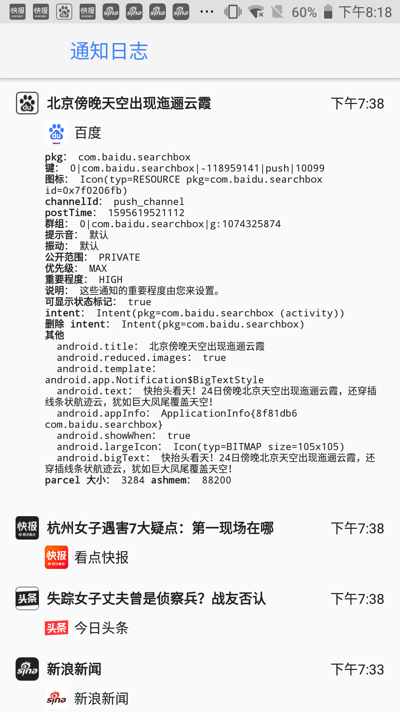
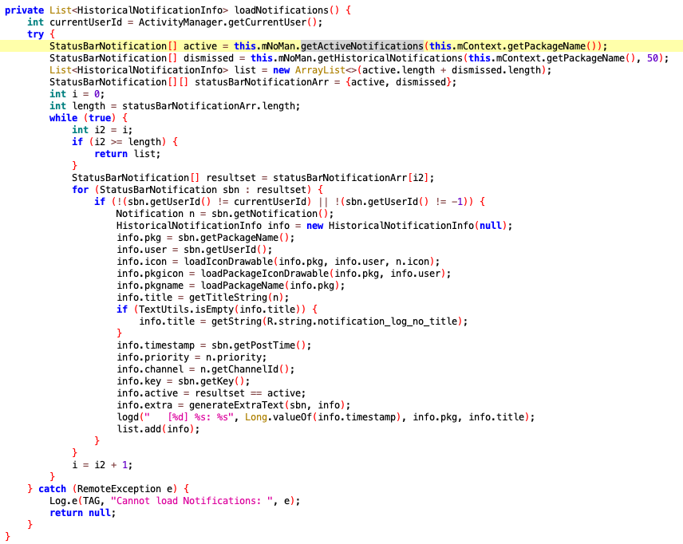
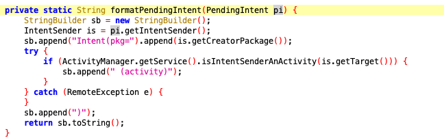

## 背景

通知是App促活用户的重要手段，推送的内容往往也是各家最时效和优质的内容。市面上的通知监控软件往往只能获取到通知的标题、内容和缩略图，无法获取到内容的地址。


## 总体思路

如何获取内容的地址？其实答案很简单，当用户点击推送的时候，会启动App跳转到对应的详情页面，那只要获取到跳转的信息，是不是大概率就能拿到内容的地址或ID了。

查阅资料发现，Android中点击通知能够跳转到对应App的Activity的关键在于PendingIntent。对于PendingIntent，其实可以从字面理解，等候着的Intent，即待触发的Intent，在通知中就是等待用户点击来触发跳转的Intent，Intent中包含了跳转Activity所需要的信息。

那么Android有没有系统级的API可以获取到所有的通知呢。查阅资料发现，我的环境（Android 8.1 LineageOS），自带通知日志微件，调出的方式是通过长按桌面，选择微件，然后选择设置中的通知日志，界面如下。


其中每一条推送包含的信息如下。



可以猜想的是这个通知日志微件中调用了系统级的API，获取到了所有活跃的、历史的通知。

保持通知日志界面打开，执行如下的命令。

```
adb shell dumpsys activity activities | grep 'Hist #'

* Hist #0: ActivityRecord{510d5d1 u0 com.android.settings/.Settings$NotificationStationActivity t227}
```

可以发现，这个界面是Settings App中的NotificationStationActivity。查阅资料发现，NotificationStation类中包含了通知日志中的逻辑操作。那么就来反编译一下Settings App，来看看内部的实现逻辑吧。

Settings属于系统级应用，通常在/system/priv-app/目录，`adb pull /system/priv-app/Settings/Settings.apk .`拉取到本地，然后用Jadx打开，找到NotificationStation类。


这里边的loadNotifications方法，应该就是我们要找的加载所有通知的入口点。



里边主要调用了getActiveNotifications和getHistoricalNotifications方法获取到了所有的通知，并解析出packagename、title等字段。

回到这张图。


这里边的Intent的内容到底是什么？Notification类中能不能拿到我们想要的PendingIntent？接着我发现了formatPendingIntent，这是生产上图Intent字段值的方法，入参就是PendingIntent。



那么一切就引刃而解了，因为获取到PendingIntent，就意味着获取到了Intent，毕竟PendingIntent是Intent的包裹。

## frida hook实践

```javascript
Java.perform(function () {
    var NotificationStation = Java.use("com.android.settings.notification.NotificationStation");
    var Bundle = Java.use("android.os.Bundle");
    var Iterator = Java.use("java.util.Iterator");
    NotificationStation.formatPendingIntent.implementation = function(pi) {
        var intent = pi.getIntent();  // 隐藏方法，系统级应用才可以调用
        var bundle = intent.getExtras();
        if (bundle != null) {
            try {
                var keys = bundle.keySet();
            } catch (e) {
                return "";
            }
            var it = keys.iterator();
            while (it.hasNext()) {
                var key = it.next();
                send(key + " " + bundle.get(key));
            }
        }
        return ""
    }
});
```

输出如下，发现我们拿到了Intent内部的所有信息。

```
{'type': 'send', 'payload': 'push_msg {"msgId":"2107407265394851840_10231046180696541845","tbMsgId":"","tbTaskId":"","cmd":"ntf","source":"push","channel":"accs","contributor":"","expired":"4h","bt":"1","pushRatio":"","pushDecline":"","pushLives":0,"der":0,"recv_time":"1595603951","bus":"PWAUP","isheadsup":false,"isPopped":false,"isDisplayed":false,"isDeleted":false,"isClicked":false,"isLocal":false,"notifyID":20005,"stats":{"st":1595567777,"rt":1},"title":"头条","text":"冠军杯两项纪录被打破，AG超玩会和DYG各占其一，一家欢喜一家愁！ 更多>>","url":"https:\\/\\/t.uc.cn\\/7_8h2tH?uc_param_str=sndnfrpfbivesscpgimibtbmntnisieijblauputoggdnwds&zzd_from=ucpush&btifl=100&uc_biz_str=S%3Acustom%7CC%3Aiflow_wm2&siteType=0&page_show_type=airship","subUrl":"","style":"19","cid":"","ticker":"头条","openWith":"1","sound":"0","vibrate":"0","deletable":"1","forceShow":"0","showWhenLocked":"0","fg":"1","bg":"1","unactive":"1"}'}
{'type': 'send', 'payload': 'tp_business_type PWAUP'}
{'type': 'send', 'payload': 'key_event_id 10'}
{'type': 'send', 'payload': 'push_msg {"msgId":"2107407265394851840_10231046180696541845","tbMsgId":"","tbTaskId":"","cmd":"ntf","source":"push","channel":"accs","contributor":"","expired":"4h","bt":"1","pushRatio":"","pushDecline":"","pushLives":0,"der":0,"recv_time":"1595603951","bus":"PWAUP","isheadsup":false,"isPopped":false,"isDisplayed":false,"isDeleted":false,"isClicked":false,"isLocal":false,"notifyID":20005,"stats":{"st":1595567777,"rt":1},"title":"头条","text":"冠军杯两项纪录被打破，AG超玩会和DYG各占其一，一家欢喜一家愁！ 更多>>","url":"https:\\/\\/t.uc.cn\\/7_8h2tH?uc_param_str=sndnfrpfbivesscpgimibtbmntnisieijblauputoggdnwds&zzd_from=ucpush&btifl=100&uc_biz_str=S%3Acustom%7CC%3Aiflow_wm2&siteType=0&page_show_type=airship","subUrl":"","style":"19","cid":"","ticker":"头条","openWith":"1","sound":"0","vibrate":"0","deletable":"1","forceShow":"0","showWhenLocked":"0","fg":"1","bg":"1","unactive":"1"}'}
{'type': 'send', 'payload': 'openurl https://t.uc.cn/7_8j3AK?uc_param_str=sndnfrpfbivesscpgimibtbmntnisieijblauputoggdnwds&zzd_from=ucpush&btifl=100&uc_biz_str=S%3Acustom%7CC%3Aiflow_wm2&siteType=0&page_show_type=airship'}
{'type': 'send', 'payload': 'policy UCM_NEW_WINDOW;UCM_NO_NEED_BACK'}
{'type': 'send', 'payload': 'tp_sub UCM_OPEN_PUSH_NOTIFICATION'}
{'type': 'send', 'payload': 'pd taobao_push'}
{'type': 'send', 'payload': 'tp UCM_OPEN_FROM_PUSH'}
{'type': 'send', 'payload': 'recv_time 1595603951'}
{'type': 'send', 'payload': 'push_msg {"msgId":"2107493893678694400","tbMsgId":"","tbTaskId":"","cmd":"ntf","source":"push","channel":"accs","contributor":"","expired":"3h","bt":"1","pushRatio":"1.0","pushDecline":"0.5","pushLives":0,"der":0,"recv_time":"1595603951","bus":"WAUP","isheadsup":false,"isPopped":false,"isDisplayed":false,"isDeleted":false,"isClicked":false,"isLocal":false,"notifyID":20004,"stats":{"st":1595569699},"title":"25篇论文被质疑造假 北大副校长回应","text":"少数标记错误，不涉及学术不端、不影响科学结论。详情>>","url":"https:\\/\\/t.uc.cn\\/7_8j3AK?uc_param_str=sndnfrpfbivesscpgimibtbmntnisieijblauputoggdnwds&zzd_from=ucpush&btifl=100&uc_biz_str=S%3Acustom%7CC%3Aiflow_wm2&siteType=0&page_show_type=airship","subUrl":"","style":"19","cid":"","ticker":"25篇论文被质疑造假 北大副校长回应","openWith":"1","sound":"1","vibrate":"1","deletable":"1","forceShow":"0","showWhenLocked":"0","fg":"1","bg":"1","unactive":"1"}'}
{'type': 'send', 'payload': 'tp_business_type WAUP'}
{'type': 'send', 'payload': 'key_event_id 10'}
{'type': 'send', 'payload': 'push_msg {"msgId":"2107493893678694400","tbMsgId":"","tbTaskId":"","cmd":"ntf","source":"push","channel":"accs","contributor":"","expired":"3h","bt":"1","pushRatio":"1.0","pushDecline":"0.5","pushLives":0,"der":0,"recv_time":"1595603951","bus":"WAUP","isheadsup":false,"isPopped":false,"isDisplayed":false,"isDeleted":false,"isClicked":false,"isLocal":false,"notifyID":20004,"stats":{"st":1595569699},"title":"25篇论文被质疑造假 北大副校长回应","text":"少数标记错误，不涉及学术不端、不影响科学结论。详情>>","url":"https:\\/\\/t.uc.cn\\/7_8j3AK?uc_param_str=sndnfrpfbivesscpgimibtbmntnisieijblauputoggdnwds&zzd_from=ucpush&btifl=100&uc_biz_str=S%3Acustom%7CC%3Aiflow_wm2&siteType=0&page_show_type=airship","subUrl":"","style":"19","cid":"","ticker":"25篇论文被质疑造假 北大副校长回应","openWith":"1","sound":"1","vibrate":"1","deletable":"1","forceShow":"0","showWhenLocked":"0","fg":"1","bg":"1","unactive":"1"}'}
{'type': 'send', 'payload': 'openurl https://t.uc.cn/7_8jwiw?uc_param_str=sndnfrpfbivesscpgimibtbmntnisieijblauputoggdnwds&zzd_from=ucpush&btifl=100&uc_biz_str=S%3Acustom%7CC%3Aiflow_site%7CK%3Atrue&siteType=0&page_show_type=airship'}
{'type': 'send', 'payload': 'policy UCM_NEW_WINDOW;UCM_NO_NEED_BACK'}
{'type': 'send', 'payload': 'tp_sub UCM_OPEN_PUSH_NOTIFICATION'}
{'type': 'send', 'payload': 'pd taobao_push'}
{'type': 'send', 'payload': 'tp UCM_OPEN_FROM_PUSH'}
{'type': 'send', 'payload': 'recv_time 1595603951'}
{'type': 'send', 'payload': 'push_msg {"msgId":"2107509862063276032","tbMsgId":"","tbTaskId":"","cmd":"ntf","source":"push","channel":"accs","contributor":"","expired":"3h","bt":"1","pushRatio":"1.0","pushDecline":"0.5","pushLives":0,"der":0,"recv_time":"1595603951","bus":"WAUP","isheadsup":false,"isPopped":false,"isDisplayed":false,"isDeleted":false,"isClicked":false,"isLocal":false,"notifyID":20003,"stats":{"st":1595573506},"title":"北京目前局地气温已超过40℃","text":"从温度分布图来看，最高温出现在通州。","url":"https:\\/\\/t.uc.cn\\/7_8jwiw?uc_param_str=sndnfrpfbivesscpgimibtbmntnisieijblauputoggdnwds&zzd_from=ucpush&btifl=100&uc_biz_str=S%3Acustom%7CC%3Aiflow_site%7CK%3Atrue&siteType=0&page_show_type=airship","subUrl":"","style":"19","cid":"","ticker":"北京目前局地气温已超过40℃","openWith":"1","sound":"1","vibrate":"1","deletable":"1","forceShow":"0","showWhenLocked":"0","fg":"1","bg":"1","unactive":"1"}'}
{'type': 'send', 'payload': 'tp_business_type WAUP'}
{'type': 'send', 'payload': 'key_event_id 10'}
{'type': 'send', 'payload': 'push_msg {"msgId":"2107509862063276032","tbMsgId":"","tbTaskId":"","cmd":"ntf","source":"push","channel":"accs","contributor":"","expired":"3h","bt":"1","pushRatio":"1.0","pushDecline":"0.5","pushLives":0,"der":0,"recv_time":"1595603951","bus":"WAUP","isheadsup":false,"isPopped":false,"isDisplayed":false,"isDeleted":false,"isClicked":false,"isLocal":false,"notifyID":20003,"stats":{"st":1595573506},"title":"北京目前局地气温已超过40℃","text":"从温度分布图来看，最高温出现在通州。","url":"https:\\/\\/t.uc.cn\\/7_8jwiw?uc_param_str=sndnfrpfbivesscpgimibtbmntnisieijblauputoggdnwds&zzd_from=ucpush&btifl=100&uc_biz_str=S%3Acustom%7CC%3Aiflow_site%7CK%3Atrue&siteType=0&page_show_type=airship","subUrl":"","style":"19","cid":"","ticker":"北京目前局地气温已超过40℃","openWith":"1","sound":"1","vibrate":"1","deletable":"1","forceShow":"0","showWhenLocked":"0","fg":"1","bg":"1","unactive":"1"}'}
{'type': 'send', 'payload': 'from push'}
{'type': 'send', 'payload': 'SELFPUSH {"s":"news_news_top","i":"20200723A0WZFF00","pid":"337190000","ty":"article","scheme":"","at":-1}'}
{'type': 'send', 'payload': 'newsSeqid 200009155'}
{'type': 'send', 'payload': 'com.sina.weibo.intent.extra.LOCALPUSH_NOTIFICATION_ID 1595584863'}
{'type': 'send', 'payload': 'com.sina.weibo.intent.extra.LOCALPUSH_NOTIFICATION_ID 1595584863'}
{'type': 'send', 'payload': 'from push'}
{'type': 'send', 'payload': 'SELFPUSH {"s":"news_news_top","i":"20200723A09NGP00","pid":"335120000","ty":"article","scheme":"","at":-1}'}
{'type': 'send', 'payload': 'newsSeqid 200009155'}
{'type': 'send', 'payload': 'from push'}
{'type': 'send', 'payload': 'SELFPUSH {"s":"news_news_top","i":"20200724V0CBUJ00","pid":"200009276","ty":"article","scheme":"","at":0}'}
{'type': 'send', 'payload': 'newsSeqid 200009155'}
{'type': 'send', 'payload': 'from push'}
{'type': 'send', 'payload': 'SELFPUSH {"s":"news_news_top","i":"DSG2020072400818700","pid":"200009163","ty":"article","scheme":"","at":0}'}
{'type': 'send', 'payload': 'newsSeqid 200009155'}
```

## 改进点

本以为到此为止大部分App的通知我们都可以获取到了，但在运行过程中发现，用该方法获取通知Intent信息，有时候会导致Settings崩溃退出。

（未完待续）
