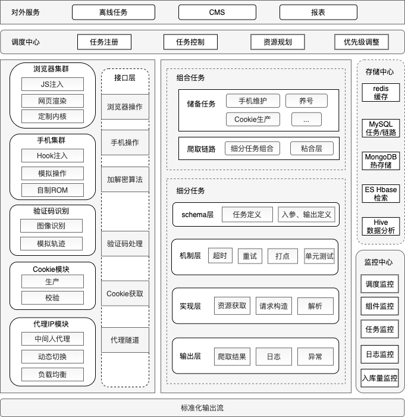

## 前言

距离写上一篇[爬虫工程师的自我修养之基础模块](https://worldwonderer.github.io/%E7%88%AC%E8%99%AB%E5%B7%A5%E7%A8%8B%E5%B8%88%E7%9A%84%E8%87%AA%E6%88%91%E4%BF%AE%E5%85%BB%E4%B9%8B%E5%9F%BA%E7%A1%80%E6%A8%A1%E5%9D%97/)已经过去大半年了，接着来填坑系统架构。现在大多数爬虫工程师似乎都在往逆向方向发展，传统系统架构相关的文章反而销声匿迹了。这里我抛砖引玉，谈一谈我在爬虫系统架构相关的理解

## 框架
scrapy已有10年的历史，pyspider从2014年发布0.1.0版本到现在竟也有7年了。无论什么爬虫框架，都绕不开调度、下载和解析，总体结构上不会有太大的差异，尤其是下载和解析，框架层面可玩的花样很少。这里我提出一种基于[celery](https://docs.celeryproject.org/en/latest/index.html)的爬虫脚手架

### 异步的好也“不好”
异步好在哪自不用说，所谓的“不好”是说什么呢？2021年了，还是能看到有爬虫工程师往scrapy/pyspider的callback解析部分中加io阻塞型代码，问就是不知道会阻塞，问就是这么写简单。可能从最初的一两行的时候没有太大影响，日子久了之后整个爬虫系统开始变得缓慢。另外tornado还好一些，twisted实在难以称为主流。使用celery，就不用去考虑爬虫编写中的异步的问题，celery在整体上对爬取任务进行加速

### 调度缺失
现有爬虫框架的调度部分相对比较薄弱，其余提供的核心能力在于异步下载能力。但大型爬虫系统中，我们更需要的是强大的调度能力，如资源分配，优先级控制

### 分布式与多爬虫管理
首先分布式方面，scrapy框架本身是偏向于单机的，虽然有scrapy-redis的加持，但分布式的调度部分功能十分匮乏。再来看多爬虫的管理部分，scrapyd就更是惨不忍睹了，在进程的维度对scrapy进行启停，并且近两年没有大的更新。celery本身就具有分布式的特征，作为专业的分布式任务调度和处理框架，无论是task还是worker层面提供的控制力是足够的

### Celery脚手架
来看一下celery脚手架的目录结构
```
├── base_task.py  # celery.Task派生类，定义超时、重试，实现打点
├── chains  # 链路
├── config.py
├── control.sh
├── sites  # 细分任务
│   ├── toutiao
│   │   ├── common
│   │   │   ├── comment.py
│   │   │   ├── __init__.py
│   │   ├── h5
│   │   │   ├── detail.py
│   │   │   ├── feed.py
│   │   │   ├── __init__.py
│   │   │   ├── user_info.py
│   │   │   └── user_statuses.py
│   │   ├── __init__.py
│   │   ├── pc
│   │   │   ├── feed.py
│   │   │   ├── __init__.py
│   │   │   ├── search_user.py
│   │   │   └── user_statuses.py
│   │   ├── phone_app
│   │   │   ├── detail.py
│   │   │   ├── __init__.py
│   │   │   ├── user_info.py
│   │   │   └── user_statuses.py
│   ├── weibo
│   │   ├── h5
│   │   │   ├── detail.py
│   │   │   ├── __init__.py
│   │   │   ├── user_info.py
│   │   │   └── user_statuses.py
│   │   ├── __init__.py
│   │   └── pc
│   │       ├── comment.py
│   │       └── __init__.py
├── exceptions.py  # 自定义异常类
├── external_interface  # 与基础模块的交互
│   ├── cookie.py
│   ├── dedup.py
│   ├── device_id.py
│   ├── __init__.py
│   ├── parse.py
│   ├── proxy.py
│   ├── sign.py
│   ├── storage.py
│   └── user_agent.py
├── monitor  # 监控
│   ├── __init__.py
├── tests  # pytest单元测试
│   ├── __init__.py
│   ├── test_weibo_h5.py
│   └── test_weibo_pc.py
├── utils  # 通用工具函数
│   ├── __init__.py
│   ├── format_date.py
└── worker.py
```
主要有两个需要关注的点，即链路(chains)和细分任务(sites)，这里详细解释一下

#### 细分任务

业务角度来看，细分任务是指能够独立完成爬取任务的最小单元，例如抓取微博的详情页，抓取头条某篇文章的评论

技术实现而言，细分任务是celery能调度的最小粒度task，有这几个层次，这里以微博详情页task为例
1. schema层：任务的说明；入参的定义，是说我需要传入这个task的参数，比如微博详情页的话就是微博ID；输出的定义，是说微博详情页解析出的字段
2. 机制层：实现了超时、重试、监控打点、单元测试，有一个很简便的实现方式是继承[Celery.Task类](https://docs.celeryproject.org/en/latest/userguide/tasks.html#task-inheritance)，定义timeout，max_retries。并且实现一些[钩子函数](https://docs.celeryproject.org/en/latest/userguide/tasks.html#handlers)，如on_success，on_failure等
3. 实现层：包含资源获取、请求构造(ip/user-agent/cookies/device_id/sign)、解析
4. 输出层：爬取结果、日志、异常信息

#### 链路

链路是指将细分任务组合起来完成一个完成的爬取需求。例如有个需求是爬取头条feed流中出现的所有作者的文章/视频及评论，链路就可以定义为
```
feed->user_info
    ->user_statuses->detail->comment
```

另外链路也可以与基础模块交互，实现一些日常任务，比如养号、cookies生产、device_id生产

## 调度
待补充

## 存储
### 队列与缓存
待补充

### 任务信息
待补充

### 热存储
待补充

### 检索
待补充

### 数据分析
待补充

## 对外能力

### 离线任务
待补充

### CMS
待补充

### 报表
待补充

## 架构图
最后附上最终的架构图


