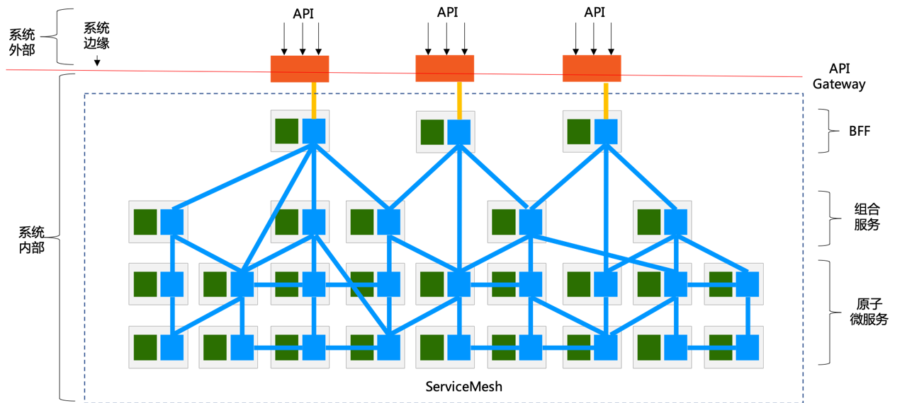

## 停更的原因

博客已经停更一年了，期间有收到gmail，微信甚至企业微信也有收到咨询，没想到还有人在看这些文章。其实我已经转型了成为一名API boy。说实话这个转变对我来说是巨大的，无论是新的语言，还是陌生的工作环境，还是说从在相对得心应手的领域变为初学者的落差。但好歹现在是适应过来了。

所以停更的原因也很简单，这一年更多处于一个学习和探索的阶段，没有什么可输出的内容。

## 这一年做的事

回顾这一年做的事算是比较纯粹，主要是做接口层的改造。

### 初体验

刚到新东家的时候，后台的整体架构比较简单，一层是接入层-迭代了近10年的php单体服务，另一层是Go中间层-从php单体服务中拆分而来。

一系列的问题：

1. 框架和周边组件老旧，安全漏洞频出
2. 代码腐化，存在大量无效、重复的代码，可维护性差
3. 缺少请求/代码块级别的并发，核心接口响应速度慢，性能较低
4. 缺乏可观测性，只有基本的被调上报，无trace能力，日志系统能力欠缺
5. 各业务部署未做隔离，存在长板效应，资源利用率低。上线影响面大，耗时长

根本原因：接入层功能过厚，集成了网关、接口适配层和业务逻辑。
解决思路：非业务功能聚合分层，业务逻辑下层至微服务。

理想形态

一个典型的微服务架构，通常分为API 网关，BFF 接口适配层和微服务，下图摘自[Service Mesh 和 API Gateway 关系深度探讨](https://www.infoq.cn/article/4FJXNTHJMio6g75uSX0h) 。

API 网关 - 负责将服务以API 的形式暴露给系统外部，统一提供鉴权、限流等非业务基础能力

BFF - Backend for front，由于端的差异性存在，服务端的功能要针对端的差异进行适配和裁剪，而服务端的业务功能本身是相对单一的，这就产生了一个矛盾——服务端的单一业务功能和端的差异性诉求之间的矛盾。通常的解决方案为增加BFF层，后端将展示字段封装成展示服务，通过GraphQL编排各微服务，聚合字段之后暴露给前端使用

组合服务 - 某些场景下需要将若干微服务的能力组合起来形成新的服务

原子微服务 - 位于最底层，以服务的形式提供各种能力

### 一期改造

todo

### 二期迭代

todo
