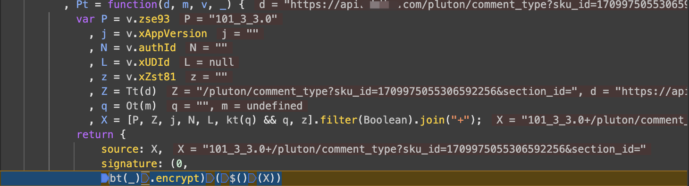
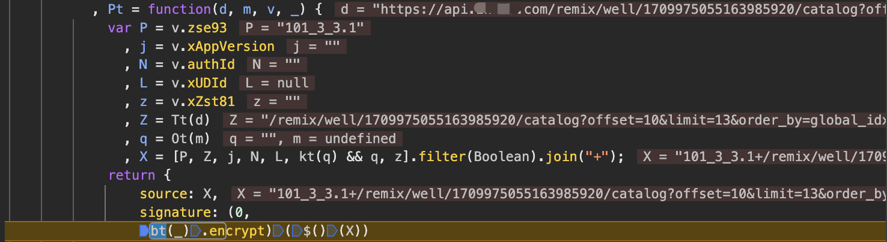

真金白银充值的 VIP，没看几篇就快过期了，为值回票价 + 后续搭建 AIGC 生产流，花了一点时间研究出了一套自动化下载流程。当然前提是你的账号必须也开通了 VIP，另外提醒账号都是绑定手机号的，下载量自己斟酌。

### 奇怪的技术栈

JS 加密：chrome console + [webdis](https://github.com/nicolasff/webdis)

字体修正：fontTools + svgwrite + [cnocr](https://github.com/breezedeus/cnocr)

### JS 加密的叛逆解法

旧版3.0加密地址：[【JS逆向系列】某乎x96参数3.0版本与jsvmp进阶](https://www.52pojie.cn/thread-1686683-1-1.html)

新版3.1抓包结果
```
X-Zse-93: 101_3_3.1
X-Zse-96: 2.0_ccanLvZlj8nYfHeG+=aHoiEe0yC7ougyse4wvclCk+w/H1xIbh89jvAUCzM4UBLO
```

跟进 JS 文件随意打几个断点发现加密函数入口，可以发现除了列表页以外其他接口的加密版本还是`101_3_3.1`。





当然，我猜测延续原来的分析方法还原算法是可行的，但可预期的是一旦算法迭代还得重新来。不如一劳永逸，用上之前方案 [Websocket与js加密函数调用
](https://pitechan.com/websocket%E4%B8%8EJS%E5%8A%A0%E5%AF%86%E5%87%BD%E6%95%B0%E8%B0%83%E7%94%A8/)。

整体思路再精简了一下，免去远端服务器部署 websocket 服务，转用从 redis 获取加密参数需求，在执行完加密入口函数后，再次调用 redis 存储与加密参数配对的加密结果。

首先，在console 用 JS 直接调用 redis 是不可行的，但 [webdis](https://github.com/nicolasff/webdis) 项目可以为我们提供一个 HTTP 协议的 redis 客户端，并且这个项目不光可以为这一需求服务，任何不方便使用 tcp 协议的地方都可以用。

那 docker 部署完成后，尝试在 chrome console 中调用，由于 chrome 的安全策略，可能会有亿点点报错。
```javascript
fetch('http://*.*.*.*:7379/', {
    method: 'POST',
    headers: {
        'Authorization': `Basic ${encodedCredentials}`,
    },
    body: body,
});
```

错误1:
```
Mixed Content: The page at 'https://www.*****.com/xen/market/remix/paid_column/1709975055163985920' was loaded over HTTPS, but requested an insecure resource 'http://*.*.*.*:7379/'. This content should also be served over HTTPS.
```
解决方法：在`chrome://flags/`的`Insecure origins treated as secure`加上远端服务器的 IP 地址。

错误2:
```
VM156:1 Refused to connect to 'http://*.*.*.*:7379/' because it violates the following Content Security Policy directive: "connect-src 'self'
```
解决方法：安装`Disable Content-Security-Policy`插件。

接下来，还需处理加密入口函数的 scope 问题。在上图断点处 debug 暂停，console 中执行如下代码，将函数转换为全局函数。不要尝试在断点处直接执行 HTTP 请求，chrome 也做了限制。

```javascript
my_ = _;
mybt = bt;
my$ = $;
```

好了退出 debug，开始指挥 GPT 写代码。

```javascript
const username = '***';
const password = '***';
const encodedCredentials = btoa(username + ':' + password);

let processAndSendData = function () {
    fetch('http://*.*.*.*:7379/LPOP/param_sign', {
            headers: {
                'Authorization': `Basic ${encodedCredentials}`
            }
        })
        .then(response => response.json())
        .then(data => {
            if (!data.LPOP) {
                console.log("No more data or error retrieving data.");
                return;
            }

            // 获取 LPOP 值
            const lpopValue = data.LPOP;
            console.log('LPOP value:', lpopValue);
            
            // 执行加密函数
            const processedValue = (0, mybt(my_).encrypt)(my$()(lpopValue));
            
            // 编码处理结果
            const encodedLpopValue = encodeURIComponent(lpopValue).replace(/\./g, '%2e');
            const encodedProcessedValue = encodeURIComponent(processedValue).replace(/\./g, '%2e');
            const body = `HSET/param_sign_ret/${encodedLpopValue}/${encodedProcessedValue}`;
            console.log(body);

            // 回传请求，将加密参数需求和加密结果成对存储
            return fetch('http://*.*.*.*:7379/', {
                method: 'POST',
                headers: {
                    'Authorization': `Basic ${encodedCredentials}`,
                },
                body: body,
            });
        })
        .then(response => response.text())
        .then(result => {
            console.log('HSET response:', result);
            processAndSendData(); // 递归调用函数以继续循环
        })
        .catch(error => {
            console.error('Error:', error);
            setTimeout(processAndSendData, 5000); // 如果发生错误，等待5秒后重试
        });
}

// 调用函数以开始循环
processAndSendData();
```

好了，在 console 执行即可。

### 字体修正

查看 html 源码，首先找到正文`style="font-family:"`使用的字体是哪一个，将字体文件下载下来，这一步比较简单不赘述。

随后我们需要做的是解析字体文件，牢记以下映射关系：

**！字形名对应了 html 源码中错误的字，而字形图则是用于替换错误字的正确字。**

#### step1. 建立字形名和字形图的映射

这一步通过`fontTools`解析字体文件，并结合`svgwrite`将字形绘制出来，那么`.svg`文件中的字形图即是正确字，`.svg`的文件名是错误字。

```python
import os

import svgwrite
from fontTools.ttLib import TTFont
from fontTools.pens.transformPen import TransformPen
from fontTools.pens.svgPathPen import SVGPathPen


def draw_all_glyphs(font_file, output_dir):
    # 创建输出目录
    os.makedirs(output_dir, exist_ok=True)
    # 加载字体文件
    font = TTFont(font_file)
    # 获取所有字形名
    glyph_names = font.getGlyphOrder()
    # 获取字形表
    glyf_table = font['glyf']

    for glyph_name in glyph_names:
        # 获取字形对象
        glyph = glyf_table[glyph_name]
        # 创建SVG画布
        drawing = svgwrite.Drawing(os.path.join(output_dir, f"{glyph_name}.svg"),
                                   size=(1000, 1000))
        # 创建SVG路径画笔
        pen = SVGPathPen(drawing)
        # 创建TransformPen对象,用于平移
        transform_pen = TransformPen(pen, (1, 0, 0, 1, 0, 120))
        # 绘制字形轮廓
        glyph.draw(transform_pen, glyf_table)
        # 添加绘制的路径到SVG画布
        drawing.add(drawing.path(d=pen.getCommands(), fill='black'))
        # 保存SVG文件
        drawing.save()
        # 将字形名转换为汉字
        if glyph_name.startswith("uni"):
            character = chr(int(glyph_name[3:], 16))
        else:
            character = glyph_name
        print(f"字形 '{character}' 已绘制并保存为 {os.path.join(output_dir, f'{glyph_name}.svg')}")
```

#### step2. 将所有字形图平铺成一张横图

这一步目的是降低 `OCR` 的成本，平铺在一张图里可节省识别次数，另外横向平铺可以免去位置识别的步骤。

```python
import os
import io
import re

from PIL import Image
import cairosvg


def tile_glyphs(svg_dir, size=(100, 100)):
    # 获取所有SVG文件
    svg_files = [f for f in os.listdir(svg_dir) if f.endswith('.svg') and 'notdef' not in f]
    # 按文件名排序
    svg_files.sort()
    # 计算PNG画布的宽度
    width, height = size
    png_width = len(svg_files) * width
    # 创建PNG画布
    png_canvas = Image.new('RGB', (png_width, height), color='white')

    # 平铺字形图像
    for i, svg_file in enumerate(svg_files):
        # 加载SVG文件
        svg_path = os.path.join(svg_dir, svg_file)
        # 读取SVG文件内容
        with open(svg_path, 'r') as file:
            svg_content = file.read()
        # 将填充颜色设置为白色
        modified_svg_content = re.sub(r'fill=".*?"', 'fill="white"', svg_content)
        # 将修改后的SVG内容转换为PNG
        png_data = cairosvg.svg2png(bytestring=modified_svg_content, output_width=width, output_height=height)
        glyph_image = Image.open(io.BytesIO(png_data))
        # 计算字形在画布上的位置
        x = i * width
        # 将字形图像粘贴到画布上
        png_canvas.paste(glyph_image, (x, 0))

    # 生成文件名
    glyph_names = [os.path.splitext(f)[0] for f in svg_files]
    output_filename = ''.join([chr(int(glyph_name[3:], 16)) for glyph_name in glyph_names]) + '.png'

    # 保存PNG文件
    png_canvas.save(output_filename)
    print(f"字形图像已平铺并保存为 {output_filename}")
    return output_filename
```

#### step3. OCR 建立文字映射关系

这一步通过 [cnocr](https://github.com/breezedeus/cnocr) 实现，将字形图和错误字的映射转为真正的文字映射，经测试小模型`ch_ppocr_mobile_v2.0`的效果最佳

```python
from cnocr import CnOcr


ocr = CnOcr(rec_model_name='ch_ppocr_mobile_v2.0')
out = ocr.ocr_for_single_line(img)
correct = out['text']
```
