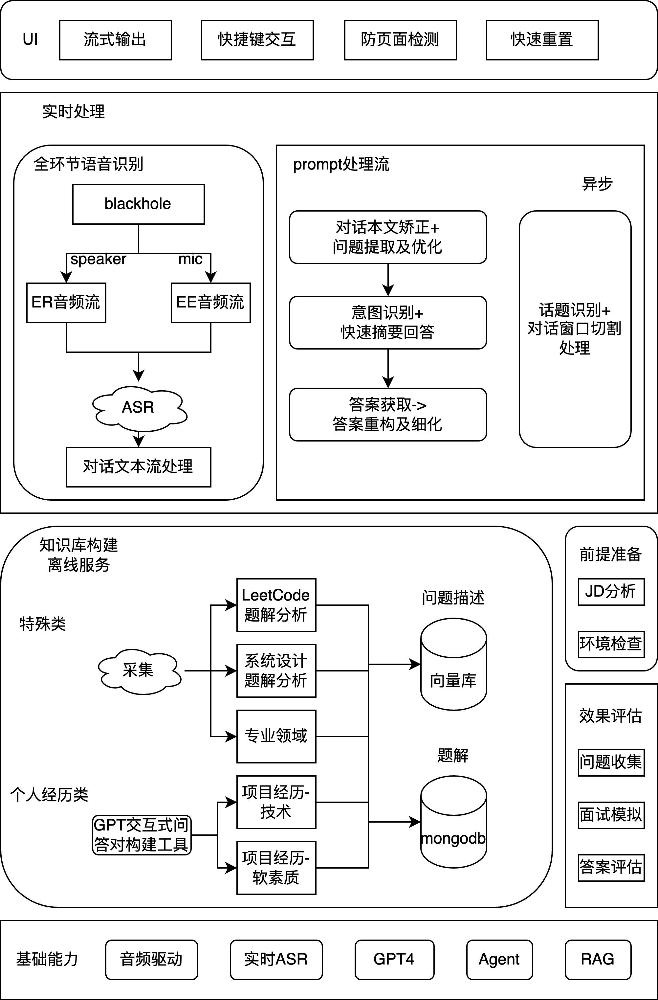

# 前言

先叠个甲，通过这个方式获取的 offer 我是不会去的。而作为面试官，我的理念是只要我的问题能被及时地、正确地、有条理地回答，至于候选人采用了什么其他辅助手段，我并不在乎。我也会周期性地评估我的面试题是否能适应新的环境。

传统的面试题整理+检索对 **fakeable** 的突破有限，且鼠标翻找笔记或者键盘在搜索引擎敲字实在观感有点差。

2023起 AI 时代下 **fakeable** 的边界或者进一步说**个人能力**重心，我认为发生了比较大的变化，有机会单开一篇讲讲。

# 技术架构

项目我取名 **rob_b_hood（宝贝计划）**

实时处理：
- [blackhole](https://github.com/ExistentialAudio/BlackHole)：虚拟音频驱动，可以在保持原音频流的同时，将 speaker（面试官）或 mic（候选人）的音频流同步转出至 ASR (automatic speech recognition)
- ASR：语音转文字部分，选型阿里云的[通义千悟](https://help.aliyun.com/zh/tingwu/voice-transcription)，支持传入实时音频流，在尾端 300ms 内返回文字流。曾经尝试过 whisper 但时延和准确率达不到要求

未完待续